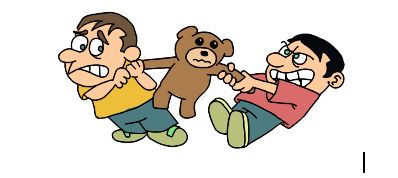
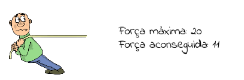

Estira que el món s’acaba
============================

Hi ha un bonic joc que consisteix en que dos equips de diferents jugadors es dediquen a estirar una corda fins que un dels dos costats cedeix.

Cada un dels participants té un nivell de força però no sempre pot estirar al màxim perquè no està completament preparat. Això fa que al estirar ho farà amb menys força de la que pot fer en teoria ...

Cada equip està format per el mateix número d’estiradors de manera que la partida quedi una mica compensada.

Exercici
-------------
Es tracta de desenvolupar un programa que permeti triar els dos equips de manera que mostrin per pantalla què passaria si es posessin a estirar la corda.

* Cada equip tindrà un número variable de jugadors que faran una força aleatòria
* Al començar el primer dels jugadors de l'equip es posarà a 200 unitats del centre de la corda i els altres a continuació.
* Els equips aniran fent estirades fins que un dels dos  aconsegueixi moure a l’altre més enllà del centre.

Execució
-----------------
El programa original el vaig fer en Java però em vaig autoreptar a fer-lo en Python per veure si n'era capaç.

Per tant per executar-lo cal tenir Python 2.7 i la llibreria PyGame instal·lada en el sistema. 

Es pot executar simplement amb:

    $ python App.py
